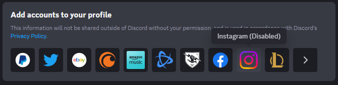

# AllConnectionsEnabled
Enables all connections (except for the Amazon Music you have to enable that via experiments)
> [!IMPORTANT]
> This plugin does not make the connections function, meaning for example if you click on Twitter (the old twitter connection not the one labeled X), nothing pops up for connection your account.
> Also for example, Instagram, it opens the page in a web browser, but will always fail when redirecting back to Discord.

